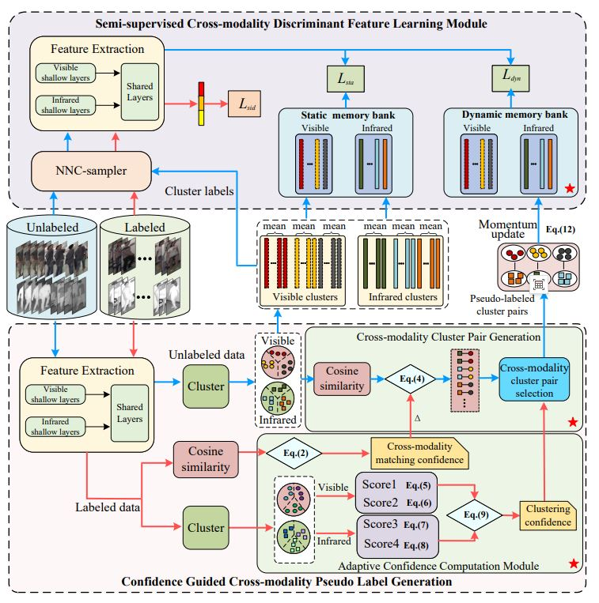

# Confidence Guided Semi-supervised Cross-Modality Person Re-Identification
we propose a Confidence Guided Semi-supervised Feature Learning (CGSFL) method for cross-modality person re-identification, which can effectively exploit the information contained in unlabeled data with the help of a small amount of labeled data. Specially, the CGSFL framework consists of two key modules, including confidence guided cross-modality pseudo label
generation module and semi-supervised cross-modality discriminant feature learning module. The former calculates the confidence of cross-modality matching and clustering, utilizing them to enhance the reliability of generated cross-modality pseudo labels. The latter designs dynamic and static memory banks as well as a nearest neighbor class-based sampler to effectively
exploit discriminant information present in labeled and pseudo-labeled data, thereby ensuring the discriminative capability of the learned model.

# Framework

# Requirement
Dependency packages that the environment may require: [requirements.txt](./requirements.txt)

# Dataset processing
First, create a data folder. Then put dataset into folder data. Finally run  prepare_data.py to prepare the training data (convert to market1501 format).

# Train 
1. sh [run\_train.sh](run_train.sh) for train

# Test 
1. sh [run\_test.sh](./run_test.sh) for test
