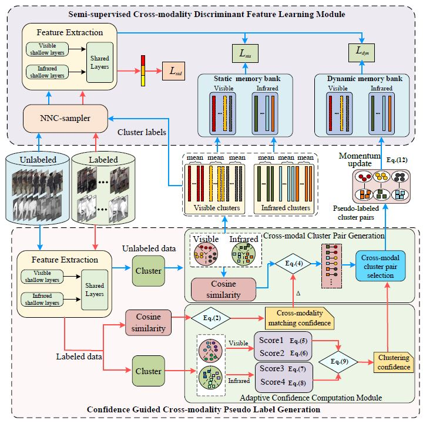

# USL Cross-Modality Person RE-identification
#### We introduced a semi-supervised learning method in cross-modal person re-identification, whose main purpose is to generate high-quality cross-modal image pairs guided by confidence scores based on supervised information, and update the memory bank. By using the interaction between features of different modalities, the model achieves the effect of reducing modal differences. Our model mainly includes two modules: Confidence Guided cross-modality pseudo-label generation and semi-supervised cross-modalality discriminative feature learning. 

# Framework

=======================
# Requirement
Dependency packages that the environment may require：
[requirement.txt](./requirement.txt)
# Dataset 
SYSU-MM01 and RegDB. 
Put SYSU-MM01 and RegDB dataset into data/sysu and data/regdb, run prepare\_sysu.py and prepare\_regdb.py to prepare the training data (convert to market1501 format).

# Train
`<1. sh run_train_sysu.sh for SYSU-MM01>`  
`<2. sh run_train_regdb.sh for RegD >`  

`<hello world>`  

# Test 
`<1. sh run_test_sysu.sh for SYSU-MM01>`  
`<2. sh run_test_regdb.sh for RegDB>`  

# Notice 
When we use the RegDB dataset for training or testing, we need to switch to a different branch network when query is visible or infrared. The Settings on Gallary are similar. We have some trained models available on [Baidu disk](https://pan.baidu.com/s/12_Kudw-4WveWr7XjpuUNkA ),code：REID.The suffix v2t indicates visible to thermal. Similar to t2v, the suffix 0.1,0.25, and 0.3 indicate the proportion of marked data added. baseline indicates that only 30% of labeled data is added in the dual-mode state. all means adding 30% of labeled data and our methods, the suffix compare means changing our labeled data take to DPSI. And a more detailed version will be uploaded when our article is accepted.....Thanks very much!
